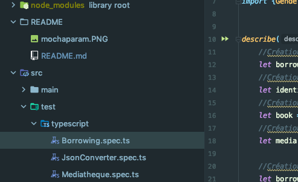
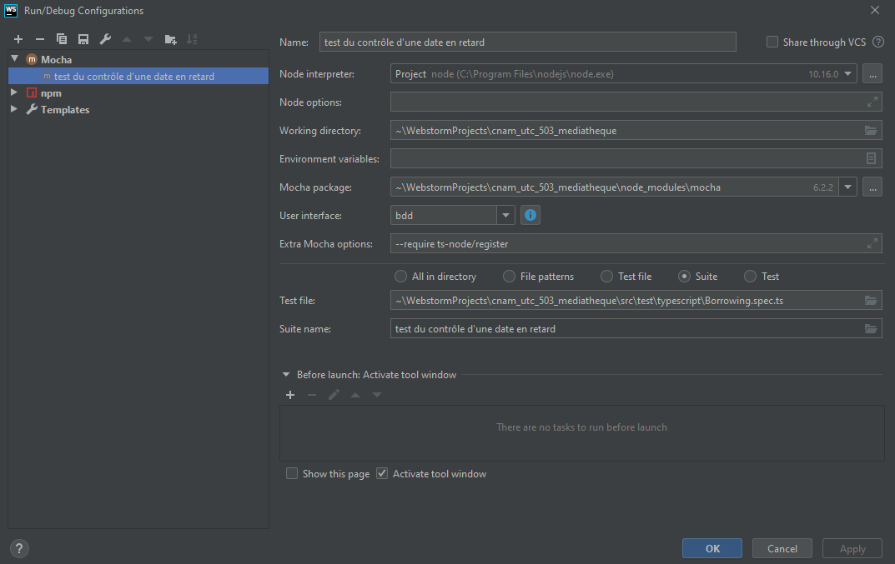

# cnam_utc_503_mediatheque

Projet effectué par Jérome Villiseck et JONATHAN Prudhomme

Programmation POO et fonctionnelle sur utc503 à livrer pour le 11/01/2020 [etudes]

Se rendre dans le wiki pour les étapes d'initialisation du projet sur sa machine locale !

Sur mac
-> telecharger d'abord git, l'installer, puis une jdk java et l'installer

https://git-scm.com/book/fr/v2/D%C3%A9marrage-rapide-Installation-de-Git

https://www.oracle.com/technetwork/java/javase/downloads/jdk8-downloads-2133151.html

Installer npm

https://treehouse.github.io/installation-guides/mac/node-mac.html

Puis

>npm install

Lancer ensuite les commandes suivantes

Taper

>tsc --version

pour controler la bonne installation de tsc, sinon l'installer

Ensuite lancer le test de cette façon

compilation dans le terminal
>tsc

execution dans le terminal
>npm run start

Port de l'application en local
>8081

En cas de pull du projet sur une nouvelle machine
Se placer avec un terminal dans le repertoire courant du projet
>sudo apt install npm

>sudo apt install node-typescript

>npm install

Invalider le cache et rédemarrer son IDE au besoin

>tsc

>npm run start

Pour automatiser les scripts, il suffit de manipuler le fichier package.json

Note à l'attention du prof
Pour les tests unitaires, il faut parametrer la configuration pour lancer un test unitaire avec mocha et surtout pas jest comme ceci :

 
 